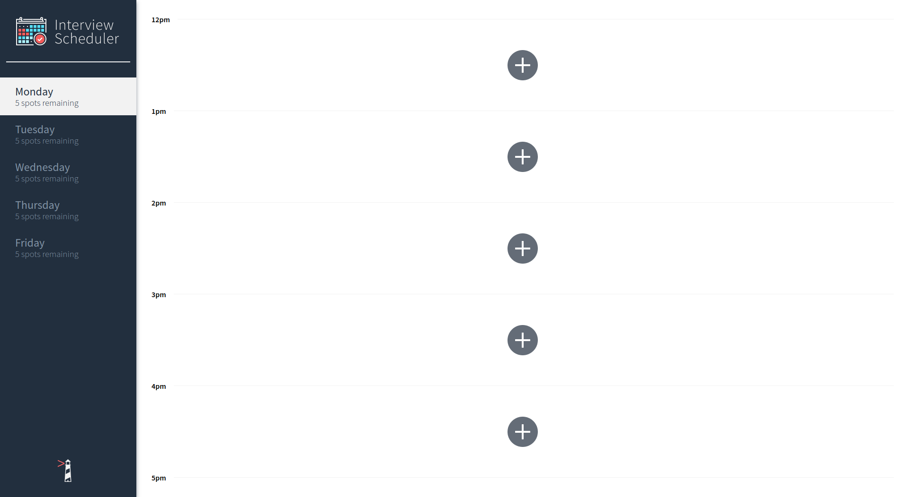
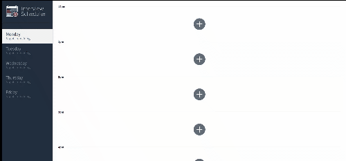
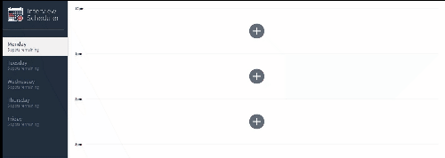
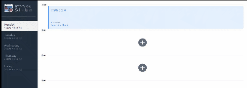

# Interview Scheduler

## Setup

Install dependencies with `npm install`.

## Running Webpack Development Server

```sh
npm start
```

## Running Jest Test Framework

```sh
npm test
```

## Running Storybook Visual Testbed

```sh
npm run storybook
```

## Final product


This is the home page. User can see select the day and time to book the appointment.

##


Above animation shows, user clicks on the '+' button to book the appointment.

##


Above animation shows how to save appointment, after the user clicks on the '+' button to book the appointment, user enters the Student name and selects the interviewer from the list and clicks on "Save" to book the appointment.

##


Above animation shows how to edit the appointment.Once the appointment is booked, if a user decides to edit the appointment (Change the student name or change the interviewer) then user clicks on the edit icon and updates the details and click on 'Save' to save the new details.

##


Above animation shows how to delete the appointment.Once the appointment is booked, if a user decides to delete the interview, user can click on delete icon and it will ask for confirmation to delete. Once the user confirms to delete the appointment the time slot is available to book another appointment.
